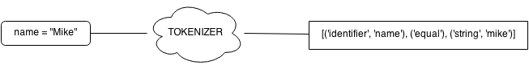

# Lexing
As stated before, lexing is the first step we go though when creating a 
compiler, lexing or tokenizing is a just a process which takes a string as 
input, divides the string onto chunks called tokens, which are just valid words
in our language, the tokenizer then returns all tokens as an array, it's 
important to note that it must also identify invalid tokens and throw 
meaningful errors.

The language we'll create is called URY and it's pretty similar to Ruby. In 
URY, variables are defined as follows

    name = "Mike"

So if we pass that input to the tokenizer, we could divide the string onto
the following tokens

As you can see, spaces are omitted, but every other string/word must be a valid
token. This is pretty common for tokenizers as we only care about significant 
tokens, comments could also be omitted if you so please. The tokenizer is quite 
easy to do on your own using regular expressions, or you can also use a library
like [Lex](http://dinosaur.compilertools.net/#lex), some libraries even take
care of lexing __and__ parsing!

In this book I'll use both approaches eventually, but first I'll do everything
from scratch, as it's good to know how stuff actually works!

## Writing a tokenizer for URY
Before jumping to our lovely text editor, let's see how URY looks like

    # comments use hashes
    # assignment
    a = 2 

    # function definition
    def add(a, b)
        return a + b
    end

    # conditional
    if a == 2
        print "a is 2"
    end

    # while loop
    while a < 5
        a = a + 1
    end

If we were to represent the input as tokens it'd look something like this

  IDENTIFIER EQUALS NUMBER

  DEF IDENTIFIER OPEN_PARENS IDENTIFIER COMMA IDENTIFIER CLOSE_PARENS
  RETURN IDENTIFIER OPERATOR IDENTIFIER
  END

  IF IDENTIFIER IS NUMBER
  IDENTIFIER STRING
  END

  WHILE IDENTIFIER OPERATOR NUMBER
  IDENTIFIER EQUALS IDENTIFIER OPERATOR NUMBER
  END

Note that spaces and comments are omitted. The names are irrelevant, you can 
name your tokens whatever you want.

We can easily match some tokens by just string comparisons, such as `def`, `if` 
and `end`, nevertheless we'll need something a bit more powerful for 
identifiers and strings! In URY an identifier is a secuence of letters and 
numbers with no space, it must start with a letter and it can contain 
underscores, the following are valid identifiers

    myVar
    var1
    person_name

The following though are __invalid__ identifiers

    1var # must start with letter
    my var # cannot contain space

 > The definition of identifier is just something I came up with and it's pretty
 > common across the most popular programming languages, especially those which
 > syntax is derived from C, you can of course choose any rules to define your
 > identifiers, for example, you can let identifiers start with a number! That's
 > the beauty of creating your very own language! Remember though that changing 
 > something just for the sake of it makes it's not a good idea since users are
 > forced to learn new syntax and rules. That's why a lot of languages stick with 
 > a syntax similar to C or another popular language (such as Ruby or Python).

Strings are defined as anyting enclosed by quotes, the following are valid strings

    "I'm a simple string"

    "I'm a
    multiline string"

    "My name is \"Mike\""

A [regular expression](http://en.wikipedia.org/wiki/Regular_expression) will do
just fine to match identifier and strings. If you don't know what regular 
expressions are you can check out [MDN's documentation on Regular Expressions](https://developer.mozilla.org/en/docs/Web/JavaScript/Guide/Regular_Expressions),
you can try your regular expressions in the browser using [Debuggex](https://www.debuggex.com/).

Now that we have an idea on what tokens we'll look for and how to match them 
let's get our hands dirty and create a tokenizer for URY! I'll create a file
named `tokenizer.js` which will contain a function which takes a string as
input and outputs a token array.
