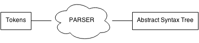
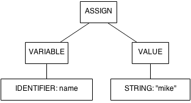

# Parsing
Parsing or semantic analysis is what gives meaning to a bunch of tokens. What 
does an identifier followed by an equal, followed by a number means? 

    a = 1

Most likely it means that I'm assigning the value `1` to the variable `a`, we'll
represent this semantic using an Abstract Syntax Tree (AST).

Using the same tokens from the example above, the parser process would look
somethig like this

    INPUT:
    [('identifier', 'name'), ('equal'), ('string', 'mike')]
    
    OUTPUT:
    [('assign', ('variable', ('identifier', 'name')), ('value', ('string', 'mike')))]

The output is a tree represented as a nested array, it might be hard to see,
but it's just a regular tree, like a genealogical tree!

Remember that in Computer Science, trees are upside down for some reason, but
it's still a tree!

In that example tree, you can see an `assign` node has two children, an
identifier and a value, which are the tree leaves (because they have no
children), this is a syntax rule, which might be defined as follows using the
[Backus-Naur Form](http://en.wikipedia.org/wiki/Backus%E2%80%93Naur_Form):

    assign ::= identifier equal expression
    expression ::= string | number

BNF is just a way to represent a grammar. I know I said I won't get deep into
theory, and I promise I wont! But let's just take a quick glance at grammars
before we continue writing our parser.

## Gammars
A grammar is a collection or rules which can accept or reject an input string,
pretty much like Regular Expressions did! But they are more powerful. The formal
definition can be found in Wikipedia:

> In formal language theory, a grammar [...] is a set of production rules for
> strings in a formal language. The rules describe how to form strings from the
> language's alphabet that are valid according to the language's syntax.

Grammars are useful because they allow us to easily build a set or rules to
identify a language. An example grammar could be defined as follows:

    start = letters
    letter = "a"
    letters = letter letters | letter

Grammars are pretty recursive, in the example above we match "a", "aa" or
"aaaa". To see it in action you can play around at [PegJS's online
parser](http://pegjs.majda.cz/online).

The example above is not very impressive right? You could do that with a regular
expression after all. Well, try to match `0^n1^n` with a regular expression,
just to be clear, it should:

    match     01
    match     0011
    match     000111
    not match 001
    not match 011

With a grammar this would be

    start = numbers

    zero = "0"
    one  = "1"

    numbers = 
     zero numbers one /
     zero one
    
With a regular expression? You can't. That's because regular expression only
match [regular
languages](http://web.stanford.edu/class/archive/cs/cs103/cs103.1132/lectures/15/Small15.pdf),
we can use them for tokenizers but for parsing we need something more. All we do
in parsing is simulate a grammar, accepting and rejecting strings as a grammar
would do.

If you want to know more about grammars and the theorical aspect of parsing you
can see [Marc Moreno Maza's
document](http://www.csd.uwo.ca/~moreno//CS447/Lectures/Syntax.html/Syntax.html)
on the matter.

## Our First Parser
Before we dive right in, let's see what we'll build. There are several ways to
write parsers, each has it's own advantages and disadvantages, for our first
parser we'll use the easiest to implement, and also the most commonly used, it's
called a Recursive Descent Parser, according to Wikipedia:

 > In computer science, a recursive descent parser is a kind of top-down
 > parser built from a set of mutually recursive procedures (or a 
 > non-recursive equivalent) where each such procedure usually implements one
 > of the production rules of the grammar. Thus the structure of the resulting
 > program closely mirrors that of the grammar it recognizes.

Summing it up, a Recursive Descent Parser is collection of functions which might
call themselves (thus they are _recursive_), and each function is in charge of
recognizing a rule in a that of grammar. 

Before writing any test, let's analyze the semantics of our language. We'll have
the following parts.

 * Atom or Literal: It's a value on it's own, for example, an string or a number
 * Expression: Can be passed as parameter or at the right hand side of an
 Assignment, it's dynamic.
 * Statement: An instruction to be executed, can be a function definition, an
   if, a while, a function call, an assignment, etc.
 * Program: A collection of statements, executed one after another.

Okay, now we know what we are looking for! Let's write some tests right into
`test/parser.js`.

    describe('Parser', function () {
      var assert    = require('assert');
      var Tokenizer = require('../src/tokenizer.js');
      var tokenizer = new Tokenizer();
      var Parser    = require('../src/parser.js');

      function parse(str) {
        var tokens = tokenizer.tokenize(str);
        var parser = new Parser(tokens);
        return parser.parse();
      }

      describe('Assignments', function () {
        it('it should work with numbers', function () {
          assert.deepEqual([
            {
              NAME: 'ASSIGNMENT',
              LHS: { NAME: 'IDENTIFIER', VALUE: 'a' },
              RHS: { NAME: 'NUMBER', VALUE: 1 },
            }
          ], parse('a = 1'));
        });
      });
    });

In the code above we make a single test, to make sure that the input `a = 1`
gets translated to `{ NAME: 'ASSIGNMENT', LHS: { NAME: 'IDENTIFIER', VALUE: 'a'
}, RHS: { NAME: 'NUMBER', VALUE: 1 } }`. The return value is a node of our AST,
and note that the parser should return an array of nodes, each node, a statement
to be executed. 

To implement our parser we'll use several recursive functions, which look
something like this:

    Parser.prototype.parseAssign = function () {
      var identifier = this.pop('IDENTIFIER');
      this.pop('EQUAL');
      var num = this.pop('NUMBER');
      return { NAME: 'ASSIGNMENT', LHS: identifier, RHS: num };
    };

The `pop` and `peek` functions are helpers we use to remove a token from the
list or just take a look at it without removing it. In the `parseAssign`
function we pop the first token and demand it to be of type `IDENTIFIER`, if
it's not of that type, the pop function will throw an exception. We save the
value returned by this function as we'll need it to return our AST node. Next we
pop an `EQUAL` token, we don't need to store this one. Then we pop a number and
finally we return a the node.

This implementation is quite limited though, note that it only work for numbers,
if we want to assign a string, this would fail.

    a = "Hello, World!"

Still, the test passes, so let's add more tests and refactor.

    it('it should work with strings', function () {
      assert.deepEqual([
        {
          NAME: 'ASSIGNMENT',
          LHS: { NAME: 'IDENTIFIER', VALUE: 'a' },
          RHS: { NAME: 'STRING', VALUE: 'some string' },
        }
      ], parse('a = "some string"'));
    });

It's obvious that we'll need something more generic, let's parse an expression
instead of just a number.

    Parser.prototype.parseAssign = function () {
      var identifier = this.pop('IDENTIFIER');
      this.pop('EQUAL');
      var exp = this.parseExpression();
      return { NAME: 'ASSIGNMENT', LHS: identifier, RHS: exp };
    };

And for the `parseExpression` definition:

    Parser.prototype.parseExpression = function () {
      var first  = this.peek();
      switch(first.NAME) {
        case 'IDENTIFIER':
          return this.parseIdentifier();
        case 'STRING':
          return this.parseString();
        case 'NUMBER':
          return this.parseNumber();
        default:
          throw 'Could not parse expression, invalid token ' + first.NAME;
      }
    };

Okay! So an expression can be an identifier, a string or a number, in that
order. We peek for the first token and then parse accordingly. In this case,
they are all _literals_ or _atoms_, so they are trivial, they only return a
token. Their implementation looks like this:

    Parser.prototype.parseString = function () {
      var result = this.pop('STRING');
      return result;
    };

Feel free to ignore this paragraph, but a nerdy point to note here is that we
are using one token to check which function we must call, this could be referred
as a LL(1) Recursive Descent Parser, if we used two tokens, it would be LL(2).
Generically, we say its a LL(k) parser, for k greater than 0 and integer.

Okay, our tests pass...sort of, we haven't really written our parser boilerplate
yet, but hang on for a while, let me finish this example and I'll show you the
boilerplate code!

Let's say we add function calls to our language, they look like this

    print("I'm an argument")

Now if we want to assign the return value of a function call to a variable, it
would look like this

    number = fibonacci(2)

Remember our parser can assign an expression to the RHS of an assignment, but
there's a problem with our expression parser, both the function call and the
identifier start with the same token, an identifier. Looks like we'll need to
peek even further!

    Parser.prototype.parseExpression = function () {
      var first  = this.peek();
      var second = this.tokens[1];
      switch(first.NAME) {
        case 'IDENTIFIER':
          if(second.NAME === 'PARENS_OPEN') {
            return this.parseFunctionCall();
          }
          return this.parseIdentifier();
        case 'STRING':
          return this.parseString();
        case 'NUMBER':
          return this.parseNumber();
        default:
          throw 'Could not parse expression, invalid token ' + first.NAME;
      }
    };

We use a second token to peek, and now we can differentiate a function call from
an identifier. The more complex the language construct, the more peek tokens
you'll need.

The boilerplate code for our parser is the following:

    /**
     * Main parser, transforms an array of tokens into an AST.
     */
    function Parser(tokens) {
      this.tokens = tokens;
    }

    Parser.prototype.parse = function () {
      var res = [];
      while(this.tokens.length > 0) {
        res.push(this.parseStatement());
      }
      return res;
    };

    // Helper methods
    // ---------------------------------------------------------------------------

    /**
     * Removes the first token from the array and returns it.
     */
    Parser.prototype.pop = function (name) {
      if(name && this.tokens[0].NAME !== name) {
        throw 'Expected ' + name + ', got ' + this.tokens[0].NAME;
      }

      return this.tokens.shift();
    };

    /**
     * Takes a peek at the tokens array and returns the first one without removing
     * it.
     */
    Parser.prototype.peek = function (name) {
      if(name && this.tokens[0].name !== name) {
        throw 'Expected ' + name + ', got ' + this.tokens[0].NAME;
      }

      return this.tokens[0];
    };

    /**
     * Consumes new lines if there
     */
    Parser.prototype.consumeNewlines = function () {
      var token = this.peek();
      while(token && token.NAME === 'NEWLINE') {
        this.pop();
        token = this.peek();
      }
    };

You can see the full code [in this
gist](https://gist.github.com/gosukiwi/ad33a3084088ca81c09e), remember you
always can see the full source code [at the GitHub
repository](https://github.com/gosukiwi/creatingaproglang-src/blob/master/src/parser.js)
and you can navigate though all different _versions_ (tags) and see how our
parser progresses. This code corresponds to version `v0.1`.

## Adding features
Let's add support for the `if` statement so you get an idea on how to extend our
little parser. First of all, by writing tests.

    describe('If statement', function () {
      it('should work with an expression', function () {
        assert.deepEqual([{
          NAME: 'IF',
          CONDITION: { NAME: 'NUMBER', VALUE: 1 },
          BLOCK: [{ NAME: 'ASSIGNMENT', LHS: { NAME: 'IDENTIFIER', VALUE: 'a' }, RHS: { NAME: 'STRING', VALUE: 'hello' } }]
        }], parse('if 1\na = "hello"\nend'));
      });
    });

As you can see, it's a pretty simple if the one we are testing, that's because
we haven't really implemented any operator (`>`, `<`, `+`, `==`, etc). Also we
haven't implemented parenthesized expressions, but we'll get there! For now,
let's just make this test pass. We'll need to parse the input:

    if 1
      a = "hello"
    end

Let's get started by adding an extra condition to the Statement parser, as the
`if` is an statement afterall.

    /**
     * Parses a statement
     */
    Parser.prototype.parseStatement = function () {
      var first  = this.peek();
      var second = this.tokens[1];
      switch(first.NAME) {
        case 'IDENTIFIER':
          if(second.NAME === 'PARENS_OPEN') {
            return this.parseFunctionCall();
          }
          return this.parseAssign();
        case 'IF':
          return this.parseIf();
        default:
          throw 'Invalid token';
      }
    };

We now need to create a `parseIf` function in charge or parsing that statement.
Note the format of the tokens: <IF> <EXPRESSION> <NEWLINE> <STATEMENTS> <END>

    /**
     * Parses an IF statement.
     * <if> <expression> <newline>* <statement>* <end>
     */
    Parser.prototype.parseIf = function () {
      this.pop('IF');
      var condition = this.parseExpression();
      this.consumeNewlines();
      // Block of statements to be executed
      var block = [];
      // We could have an empty if, so peek for statements
      while(this.peek().NAME !== 'END') {
        block.push(this.parseStatement());
      }
      this.pop('END');
      this.consumeNewlines();
      return { NAME: 'IF', CONDITION: condition, BLOCK: block };
    };

Pretty straight forward! If you run `mocha test/` now, all tests pass. This is
looking pretty but our implementation is quite limited, expressions should be
able to include operators. Let's add some. Before diving into parsers, let's
define a little helper function which will save us some typing later on:

    /**
     * Extend strings to support the _inside_ method. This method returns true if
     * the string is inside of an array.
     *
     * "apple".inside(["orange", "banana", "apple"]); // true
     */
    String.prototype.inside = function(arr) {
      var self = this;
      arr.forEach(function (item) {
        if(self === item) {
          return true;
        }
      });

      return false;
    };

That little method will allow us to quickly check if a string is inside an
array. Let's write a test:

    it('should work with an expression with an operator', function () {
      assert.deepEqual([{
        NAME: 'IF',
        CONDITION: { NAME: 'BINARY_OPERATION', OPERATION: 'AND', LHS: { NAME: 'IDENTIFIER', VALUE: 'a' }, RHS: { NAME: 'IDENTIFIER', VALUE: 'b' } },
        BLOCK: [{ NAME: 'ASSIGNMENT', LHS: { NAME: 'IDENTIFIER', VALUE: 'a' }, RHS: { NAME: 'STRING', VALUE: 'hello' } }]
      }], parse('if a and b\na = "hello"\nend'));
    });

And extend the expression parser:

    Parser.prototype.parseExpression = function () {
      var first  = this.peek();
      var second = this.tokens[1];
      switch(first.NAME) {
        case 'IDENTIFIER':
          if(second.NAME === 'PARENS_OPEN') {
            return this.parseFunctionCall();
          } else if(second.NAME.inside(['AND', 'OR'])) {
            return this.paseBinaryOperation();
          }
          return this.parseIdentifier();
        case 'STRING':
          return this.parseString();
        case 'NUMBER':
          return this.parseNumber();
        default:
          throw 'Could not parse expression, invalid token ' + first.NAME;
      }
    };

Note that I had to add some tokens for that!

    new Token('AND', '^and'),
    new Token('OR', '^or'),

Now let's create the `parseBinaryOperation` parser.

    Parser.prototype.paseBinaryOperation = function () {
      var lhs = this.parseIdentifier();
      var operation = this.pop().NAME;
      var rhs = this.parseExpression();
      return { NAME: 'BINARY_OPERATION', OPERATION: operation, LHS: lhs, RHS: rhs };
    };

The LHS of the operation is always an identifier, the right side can be
anything. This is a limitation, we can't match an identifier on the LHS because
it would cause an infite loop. There are ways to get around this, for example,
we could create a parser which parses basic expressions, and a different which
parses the same expressions but it's more potent and can also parse binary
operations, that way we could write

    Parser.prototype.paseBinaryOperation = function () {
      var lhs = this.weakParser();
      var operation = this.pop().NAME;
      var rhs = this.strongParser();
      return { NAME: 'BINARY_OPERATION', OPERATION: operation, LHS: lhs, RHS: rhs };
    };

That way we would be changing the rules of our grammar, but this can get out of
hand quickly and it's really hard to think of a grammar in term of your
functions. Also, we don't take into account error generation, what if the code
has a syntax error? This grammar won't give you much info on your error, not
even a line number. Mainly for those two reasons, we'll learn to use some new
tools in the next chapter which will make this job a bit easier. So far this
code is `v0.2` and you can see the full source code [at the GitHub
repository](https://github.com/gosukiwi/creatingaproglang-src/tree/v0.2). 

## Summary

As you can see rolling our own grammar is easy for small languages, like
template engines and DSLs, but as you need more power, it gets hard and harder
to write the appropiate parsers. Let's make our lives easier with a _parser
geneartor_.
